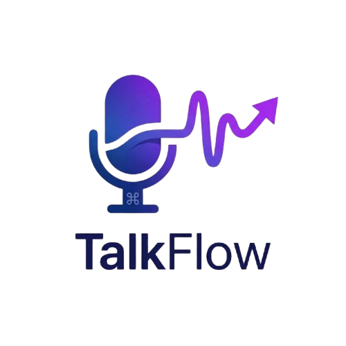
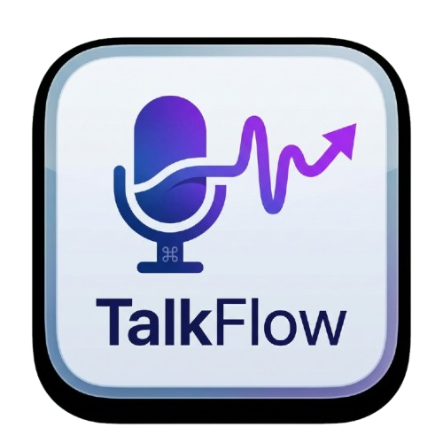

# TalkFlow

<p align="center">
  
</p>

<p align="center">
  <strong>Voice-to-text dictation for macOS, powered by AI</strong>
</p>

<p align="center">
  Press and hold a key to record. Release to transcribe. Text appears instantly.
</p>

---

TalkFlow is a native macOS menu bar app that transforms your voice into text using OpenAI's Whisper API. Hold down a trigger key (default: Right Command), speak, and release—your transcription is automatically pasted into whatever app you're using.

## Features

- **Press-and-hold activation** — Hold the trigger key to record, release to transcribe. No clicking required.
- **Instant paste** — Transcribed text is automatically inserted into your focused input field.
- **Configurable shortcuts** — Remap the trigger to any modifier key, single key, or key combination.
- **Smart audio processing** — Voice activity detection and silence removal for clean, efficient transcriptions.
- **History with search** — All transcriptions are saved locally with full-text search.
- **Privacy-focused** — Audio is never saved to disk. API keys stored securely in macOS Keychain.
- **Visual feedback** — Floating indicator shows recording, processing, and completion states.
- **Multi-monitor support** — Indicator appears on whichever display your cursor is on.

## Requirements

- macOS 15 (Sequoia) or later
- OpenAI API key with access to the Whisper API

## Installation

### From Source

```bash
# Clone the repository
git clone https://github.com/jcampuza/voice-dictation-ai-macos.git
cd voice-dictation-ai-macos/TalkFlow

# Build the app
./Scripts/build-app.sh release

# Launch
open .build/release/TalkFlow.app
```

Or build and launch in one step:

```bash
./Scripts/build-app.sh release --run
```

## Setup

1. **Launch TalkFlow** — The app runs in your menu bar.
2. **Grant permissions** — You'll be prompted for:
   - **Accessibility**: Required for global shortcuts and text insertion
   - **Microphone**: Required for audio capture
3. **Add your API key** — Open Settings and enter your OpenAI API key.
4. **Start dictating** — Hold Right Command (or your configured trigger), speak, and release.

## Usage

| Action | Result |
|--------|--------|
| Hold trigger key | Start recording (after 300ms) |
| Release trigger key | Stop recording and transcribe |
| Press another key while holding | Cancel recording |
| Click menu bar icon | Open menu with recent transcriptions |

### Indicator States

| State | Appearance |
|-------|------------|
| Recording | Pulsing red/orange |
| Processing | Blue with spinner |
| Success | Green checkmark |
| Error | Red with message |
| No Speech | Yellow/orange |

## Settings

Access settings from the menu bar icon → Settings:

- **Shortcut** — Configure your trigger key
- **Audio** — Select input device, adjust silence threshold
- **Transcription** — API key, model selection, language preference
- **Output** — Toggle punctuation stripping
- **Appearance** — Indicator visibility and position

## Data Storage

- **Transcription history**: `~/Library/Application Support/TalkFlow/transcriptions.sqlite`
- **Logs**: `~/Library/Logs/TalkFlow/talkflow.log`
- **API key**: macOS Keychain (never stored in plain text)

## Development

```bash
# Debug build
swift build

# Run tests
swift test

# Build app bundle
./Scripts/build-app.sh

# Build and launch
./Scripts/build-app.sh --run
```

## Tech Stack

- **Swift 6** with modern concurrency (async/await, actors)
- **SwiftUI** for all UI components
- **AVFoundation** for audio capture
- **Accelerate/vDSP** for signal processing
- **GRDB.swift** for SQLite storage with full-text search

## License

MIT

---

<p align="center">
  
</p>
